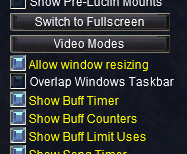
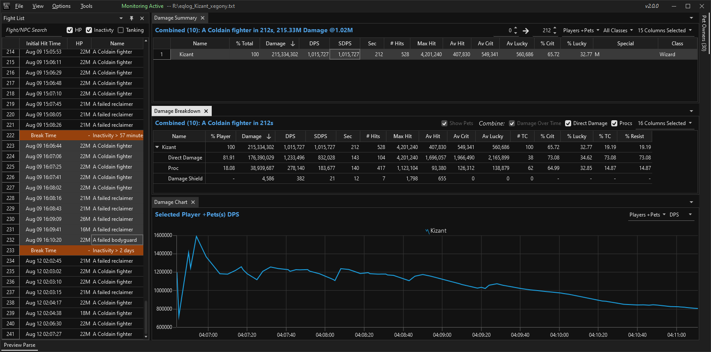
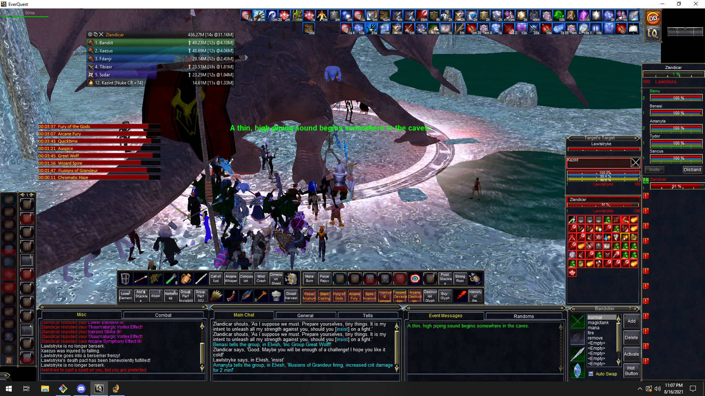

# EQLogParser
Everquest Log Parser for Live/TLP servers with basic support for P99.

Link to DOWNLOAD the latest Installer: 
https://github.com/kauffman12/EQLogParser/raw/master/Release/EQLogParser-install-2.2.48.exe

Minimum Requirements:
1. Windows 10 x64
2. .Net 8.0 Desktop Runtime for x64

.Net 8.0 is provided by Microsoft but is not included with Windows. It can be downloaded from here: 
https://dotnet.microsoft.com/en-us/download/dotnet/thank-you/runtime-desktop-8.0.7-windows-x64-installer

If Everquest is in windowed mode but the Damage Meter or other overlays are hidden when you switch to the game make sure Overlap with Taskbar is turned off: 

Note for Developers: 
Syncfusion components used by this application require a license. If you apply for a community license you should be able to get one for free.

Additional Notes: 
The installer for EQLogParser has been signed with a certificate. It's recommended that the following steps are done ONCE so that you're sure you have an official version. After your system trusts the certificate you'll notice the install prompt will be blue in color and no longer say Unknown Publisher. Then in the future if it returns to yellow/Unknown Publisher you'll know that the installer either wasn't from me or I had to change certificates. Which I will mention here if I have change them. Note that this is not required and if you don't bother installing the certs everything should still work fine.

1. right-click the exe file and choose properties
2. under the digital signatures tab select the one signature and click details
3. click View Certificate
4. click Install Certificate

Lastly, EQLogParser-2.2.13.msi in the Releases folder can be ignored by most people. It exists to allow auto update to work from old versions of the parser. Old parsers were hard coded to look for MSI files and this one just wraps the exe installer for 2.2.13. Then the next time the parser is started it will auto update to the latest exe installer.

# Example

# Damage Meter and Timer Overlay Example

